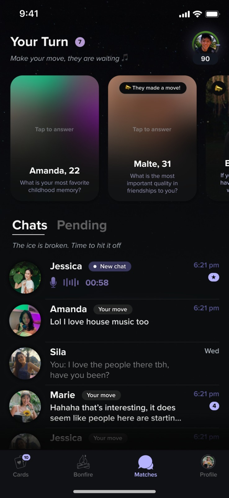
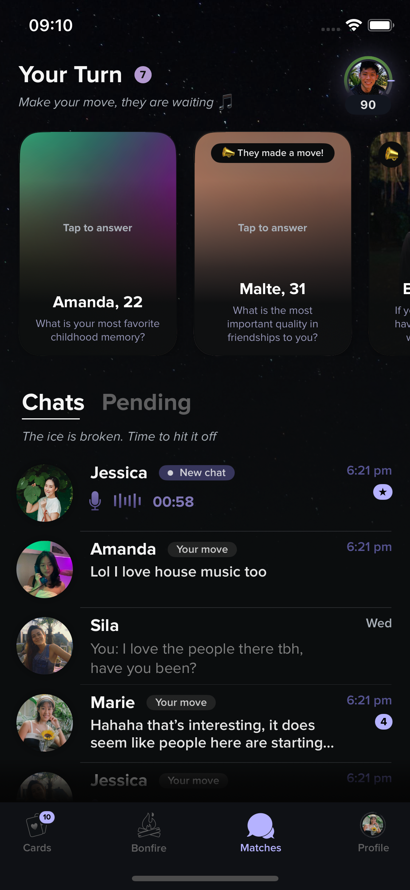

# Hi! This is the result of the Task 1 for Stroll

---

## Full Task

- Replicate the UI — *ignore functionality for now*  
- Output should be **pixel-perfect**  
- Make sure it looks great on **all iPhones (iPhone X onwards)** — can ignore iPhone SE  
- Maintain **good code standards**

---

## The Output

<table>
  <tr>
    <td align="center">
       
      <b>Reference</b>
    </td>
    <td align="center">
       
      <b>Recreated result</b>
    </td>
  </tr>
</table>

---

