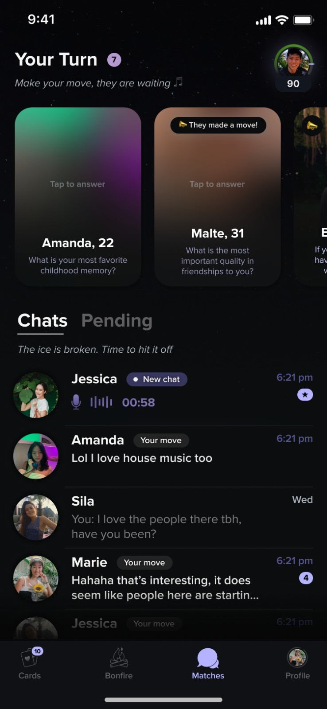
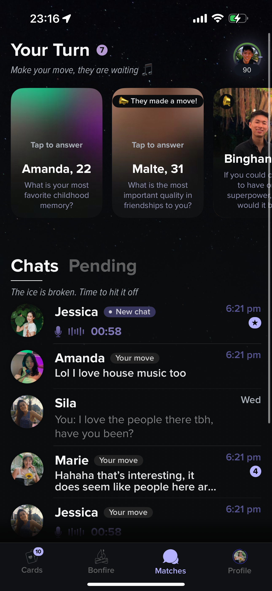
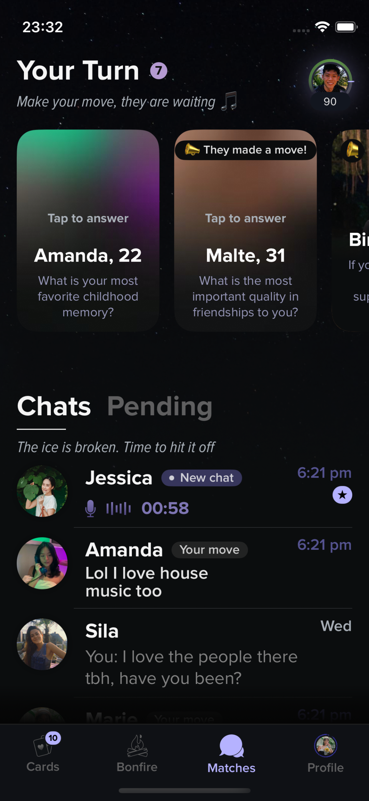

# Stroll — Task 1: Recreate UI

---

## Full Task

- Replicate the UI — *ignore functionality for now*  
- Output should be **pixel-perfect**  
- Make sure it looks great on **all iPhones (iPhone X onwards)** — can ignore iPhone SE  
- Maintain **good code standards**

---

## Reference UI

UI reference from dating app **Stroll**:

---

## The Output

### iPhone 14 Pro Max

### Demo Video

### iPhone 13 mini

---

## ⭐ Bonus: Dynamic Type Support

### xxxLarge Text — iPhone 14 Pro Max

### xxxLarge Text — iPhone 13 mini

